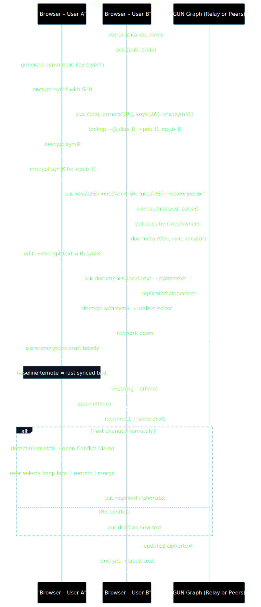

# P2P Editor – Offline-First Realtime Collaboration

**Running the suite**

```bash
# 1. Install dependencies
npm install  # or pnpm/yarn

# 2. Start a local GUN relay (optional but recommended for stability):
node gun-server.js

# 3. Launch the dev UI (served via Quasar Vite)(seperate terminal):
npm run dev      # alias for `quasar dev`

# You can run the automated tests (seperate terminal):
npm run test:e2e

# interactive GUI
npm run cypress:open
```

**About the relay:**

This project remains **server-less** in the architectural sense—each browser keeps its own copy of the data and can sync **directly** with any accessible peer.

The `gun-server.js` script is merely a convenience bootstrap **peer** that:

- Speaks WebSocket protocol
- Allows tabs/devices to discover each other
- Helps bootstrap when no other peers are online yet
- Can be run by any participant (no central authority)

If you skip running the relay locally, the app will automatically connect to GUN's public Manhattan relay. This means:

- The "no-backend" promise remains intact
- Local relay is optional but recommended for:
  - Faster test execution
  - Deterministic storage for demos
  - Keeping your data on your machine

---

## 1 · User Guide

### What is P2P Editor?

P2P Editor is a **server-less**, real-time text editor that keeps working even when you lose your internet connection.  
It lets you:

1. Create, rename and delete documents that live entirely in your browser.
2. Invite collaborators by their username and assign them **viewer** or **editor** roles.
3. Work together live – changes appear instantly for peers who are online, and are synced automatically for anyone who reconnects later.
4. Go offline at any time. Edits you make are stored locally and merged back in when the network returns.  
   • If a true conflict happens, a visual **Conflict Resolution** dialog lets you keep local, accept remote or merge line-by-line.
5. Export an encrypted _recovery file_ that contains the keys to your account so that you can restore access from another computer or after clearing your browser.

### Using the app

1. **Sign-Up / Sign-In** – choose an alias and passphrase. Your identity key-pair is created inside the browser; no server ever sees your password or keys.
2. **Home** – the document list shows everything you own or that was shared with you. Use _New Document_ to create one or _Share_ to invite others.
3. **Editing** – the page switches to the Quasar `q-editor` component. You can press the back arrow to return to the list.
4. **Offline mode** – simply turn off your connection. The network status is monitored automatically; drafts are cached until you return online.
5. **View-only sessions** – if you open a document as a _viewer_ you’ll see a grey “View Only” badge and the editor is locked.
6. **Recovery** – in the toolbar, click _Download Recovery_. Keep the resulting JSON file safe. From the login screen you can _Recover_ using either that file+username **OR** file+passphrase.
7. **Document list context** – each row shows the creator’s alias and your access level (owner / editor / viewer). Icons adapt: viewers see no rename/share/delete, editors see rename & share, only owners can delete.
8. **NavBar** – once signed in, your alias is displayed as a chip on the top-right for quick context.

---

## 2 · Technical Documentation

> This section reflects the project goals laid out in the original capstone exposé and highlights the design decisions made along the way.

### 2.1 Technology Choices

| Concern          | Original Idea                  | Final Choice                 | Rationale                                                                                                                                                                                                                                        |
| ---------------- | ------------------------------ | ---------------------------- | ------------------------------------------------------------------------------------------------------------------------------------------------------------------------------------------------------------------------------------------------ |
| **UI Toolkit**   | TailwindCSS                    | **Quasar Framework**         | Quasar wraps Tailwind-like utility classes with a rich component set (dialogs, editor, toolbars) and first-class Vite integration. It accelerated development while still allowing Tailwind-style `class="q-mx-sm"` utility shortcuts.           |
| **Transport**    | PeerJS (WebRTC)                | **Native GUN network layer** | PeerJS adds a signalling server and an imperative message API. GUN already embeds WebSocket/WebRTC transport, routing and storage, so PeerJS would duplicate work and re-introduce servers.                                                      |
| **Cryptography** | Browser-generated **RSA** keys | **GUN SEA (ECDSA / ECDH)**   | RSA keys are large (2–4 KiB) and slow in JS. SEA’s curve-based crypto is smaller, faster and deeply integrated with GUN’s user model (alias, epub, epriv).                                                                                       |
| **CRDT**         | Implement Yjs                  | **Built-in GUN CRDT (HAM)**  | Yjs offers fine-grained structures but requires a separate provider and server for persistence. GUN’s **Hypothetical Amnesia Machine (HAM)** gives us last-write-wins CRDT semantics out-of-the-box, stored in a graph and synced automatically. |

### 2.2 GUN, HAM & CAP

- **HAM** (Hypothetical Amnesia Machine) assigns each mutation a _state vector_ (timestamp + actor id).  
  On conflicts, HAM deterministically picks the higher state, ensuring _monotonic_ convergence.
- In CAP terms, GUN chooses **AP** (Availability + Partition tolerance) over strict Consistency. Updates are accepted locally first, replicated when possible, and eventually every peer converges.

### 2.3 High-Level Architecture



#### Identity Bootstrap

The browser signs in against any GUN peer and receives a key-pair acknowledgment.

#### Document Creation & Sharing

The creator generates a fresh symmetric key, stores it encrypted for themselves, then re-encrypts and stores it for each collaborator's public key, assigning a role (viewer/editor).

#### Document Discovery

Peers list documents by scanning owners and roles directories; each row shows the stored creator alias and the current user's role.

#### Live Editing Loop

Edits are symmetrically encrypted locally, written once, replicated by GUN, and decrypted on every peer—no server transforms the payload.

#### Offline Draft & Conflict Path

While disconnected, a draft copy is cached locally. On reconnection the editor compares the draft with the baseline remote version. If remote changed, the Conflict Resolution dialog lets the user merge, keep local, or accept remote. Otherwise the draft is flushed automatically.

### 2.4 Store Responsibilities

- **AuthStore** – wraps `gun.user()` providing sign-up, login, logout and _download recovery_ / _recoverLogin_ helpers.
- **DocumentStore** – handles metadata: create, rename, share, delete, list. Shares symmetric doc keys by encrypting them _per recipient_ using ECDH.
- **EditorStore** – manages active doc, local caching, encryption of text, draft queue when offline, conflict detection & resolution workflow.
  • Enforces role-based permissions via a reactive `canEdit` flag; viewers have the editor set to `readonly + disable`, displaying a **View Only** badge in the UI.
- **NetworkStore** – watches `navigator.onLine` and propagates status so EditorStore can decide when to queue drafts.
- **DialogStore** – centralised toggles/data for the Quasar dialogs.
- **Boot › `src/boot/vueGun.js`** – instantiates the GUN node with default peers, registers the `vue-gun` plugin and exposes helpers (`window.restoreGunConnections()`, `window.blockGunConnections()`). This is where the mesh is re-wired when the browser regains connectivity.
- **Layout › `src/layouts/MainLayout.vue`** – application shell wrapping every page. It renders the navigation bar and an **offline banner** that reacts to `NetworkStore.isOnline`, so users immediately understand whether edits will sync.

### 2.5 User Flow Walkthrough

1. **Create Document**  
   a. Client generates 256-bit random symmetric key.  
   b. Encrypts it with own public encryption key (_epub_) via ECDH → stores under `keys/<myPub>`.
2. **Share Document**  
   a. Lookup recipient alias → public key → epub.  
   b. Decrypt own sym-key, re-encrypt with recipient’s epub, store under `keys/<theirPub>` and mark role.
3. **Edit**  
   a. On each keystroke, EditorStore encrypts text with sym-key and does `put` to `text`.  
   b. HAM replicates change; peers decrypt with their sym-key.
4. **Offline**  
   a. Edits are encrypted then stored under `drafts/<myPub>` instead of `text`.  
   b. When back online, drafts reconcile vs latest remote: auto-apply, keep local, accept remote or merge.
5. **Account Recovery**  
   a. User exports `{ alias, keys }`.  
   b. To recover they supply file + (alias **OR** passphrase).
   c. AuthStore calls `user.auth(pair)` (file+alias) _or_ `user.auth(alias, pass)` (file+pass).

### 2.6 Deletion & Tombstoning

GUN is eventually consistent; peers may be offline when you delete data.  
Therefore _true_ deletion means writing **`null`** (a tombstone) so every peer learns “this node is gone”.

```ts
// remove our access
user.get('docs').get(docId).put(null);
// null the doc itself – other peers replicate the tombstone
gun.get('documents').get(docId).put(null);
```

If we simply removed the key locally, an offline peer could later re-introduce the outdated value ("the resurrecting zombie" problem). Null writes propagate and override stale copies, solving the tombstoning challenge.

### 2.7 Evaluation

- **Goals met:** fully browser-based identity, P2P collaboration, conflict resolution UI, offline support.
- **Limitations:**
  - No granular TTBR/garbage-collection – relay peer may accumulate tombstones.
  - HAM is LWW; more sophisticated merge semantics (e.g. per-character CRDT) could avoid conflicts entirely but the expose explicitly set out to **demonstrate conflict management**. Using a full-fledged per-character CRDT (Yjs/Automerge) would remove most user-visible conflicts, making that goal moot while adding significant encryption, storage and performance overhead. HAM’s last-writer-wins model generates _occasional, resolvable_ divergences—perfect for showcasing a dedicated merge dialog.

### 2.8 Automated End-to-End Tests (Cypress)

The `cypress/` directory hosts an extensive suite covering the happy-paths **and** edge cases promised in the exposé.

| Spec File          | Purpose                                                                                                                             |
| ------------------ | ----------------------------------------------------------------------------------------------------------------------------------- |
| `auth.cy.ts`       | “Golden-path” sign-up, logout, login.                                                                                               |
| `auth_edge.cy.ts`  | Duplicate alias & wrong-password scenarios.                                                                                         |
| `document.cy.ts`   | Create & delete document flow.                                                                                                      |
| `sharing.cy.ts`    | Verify visibility pre/post sharing to another alias.                                                                                |
| `sync.cy.ts`       | End-to-end real-time sync between owner & collaborator.                                                                             |
| `offline_ui.cy.ts` | Banner messaging when `NetworkStore.isOnline` flips.                                                                                |
| `conflict.cy.ts`   | Force offline, diverge edits, simulate remote change, ensure **Conflict Resolution Dialog** behaves as designed.                    |
| `recovery.cy.ts`   | Download recovery JSON, restore via file+alias or file+pass, plus validation errors.                                                |
| `scale.cy.ts`      | Stress test: 50 kB document, share with 5 collaborators (mix of editors & viewers), verify viewer lock-down and cross-peer updates. |
| `ui_roles.cy.ts`   | UI regression for role labels, icon visibility and "View Only" badge behaviour.                                                     |

**Helpers & Custom Commands**

- `cypress/support/e2e.ts` adds `cy.signup`, `cy.login`, `cy.logout` for succinct test scripts while preserving TS typings via _global augmentation_.
- Tests simulate offline by overriding `navigator.onLine` **and** calling the dev helpers `window.blockGunConnections()` / `window.restoreGunConnections()` that the boot file exposes.

---

## Live Deployment

- SPA URL: [https://canturgay.github.io/p2pEditor/#/](https://canturgay.github.io/p2pEditor/#/)
- GUN Relay URL: [https://chilly-charmain-can-turgay-2bdb3640.koyeb.app](https://chilly-charmain-can-turgay-2bdb3640.koyeb.app)
